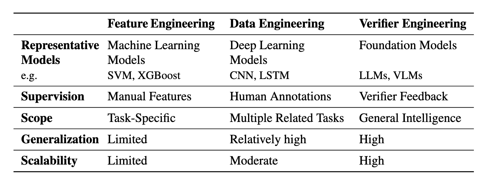
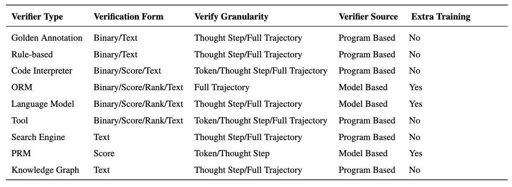

# Search, Verify and Feedback: Towards Next Generation Post-training Paradigm of Foundation Models via Verifier Engineering

This is a collection of papers and other resources for verifier engineering, which corresponds to the paper [Search, Verify and Feedback: Towards Next Generation Post-training Paradigm of Foundation Models via Verifier Engineering](paper/ve.pdf). We will update the paper content and this repo regularly, and we very much welcome suggestions of any kind.

## Comparison of feature engineering, data engineering and verifier engineering

## A comprehensive taxonomy of common verifiers across four dimensions

