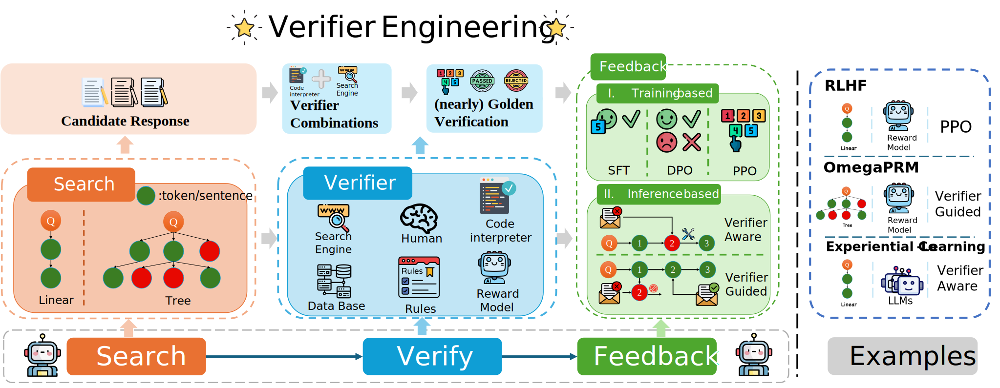

# Search, Verify and Feedback: Towards Next Generation Post-training Paradigm of Foundation Models via Verifier Engineering

This is a collection of papers and other resources for verifier engineering, which corresponds to the paper [Search, Verify and Feedback: Towards Next Generation Post-training Paradigm of Foundation Models via Verifier Engineering](paper/ve.pdf). We will update the paper content and this repo regularly, and we very much welcome suggestions of any kind.

## Overview of Common Verifiers

| **Verifier Type**    | **Verification Form**           | **Verify Granularity**               | **Verifier Source**   | **Extra Training** |
|-----------------------|---------------------------------|---------------------------------------|-----------------------|--------------------|
| Golden Annotation     | Binary/Text                   | Thought Step/Full Trajectory         | Program Based         | No                 |
| Rule-based            | Binary/Text                   | Thought Step/Full Trajectory         | Program Based         | No                 |
| Code Interpreter      | Binary/Score/Text             | Token/Thought Step/Full Trajectory   | Program Based         | No                 |
| ORM                   | Binary/Score/Rank/Text        | Full Trajectory                      | Model Based           | Yes                |
| Language Model        | Binary/Score/Rank/Text        | Thought Step/Full Trajectory         | Model Based           | Yes                |
| Tool                  | Binary/Score/Rank/Text        | Token/Thought Step/Full Trajectory   | Program Based         | No                 |
| Search Engine         | Text                          | Thought Step/Full Trajectory         | Program Based         | No                 |
| PRM                   | Score                         | Token/Thought Step                   | Model Based           | Yes                |
| Knowledge Graph       | Text                          | Thought Step/Full Trajectory         | Program Based         | No                 |

## A Verifier Engineering Perspective on Post-Training Methods

|                           | **Search**            | **Verify**                              | **Feedback**         | **Task**              |
|---------------------------|-----------------------|-----------------------------------------|----------------------|-----------------------|
| STar   RFT            | Linear               | Golden Annotation                       | Imitation Learning   | Math                 |
| CAG                       | Linear               | Golden Annotation                       | Imitation Learning   | RAG                  |
| Self-Instruct             | Linear               | Rule-based                              | Imitation Learning   | General              |
| Code Alpaca   WizardCoder | Linear            | Rule-based                              | Imitation Learning   | Code                 |
| ILF-Code                  | Linear               | Rule-based & Code interpreter          | Imitation Learning   | Code                 |
| RAFT   RRHF            | Linear               | ORM                                     | Imitation Learning   | General              |
| SSO                       | Linear               | Rule-based                              | Preference Learning  | Alignment            |
| CodeUltraFeedback         | Linear               | Language Model                          | Preference Learning  | Code                 |
| Self-Rewarding            | Linear               | Language Model                          | Preference Learning  | Alignment            |
| StructRAG                 | Linear               | Language Model                          | Preference Learning  | RAG                  |
| LLAMA-BERRY               | Tree                 | ORM                                     | Preference Learning  | Reasoning            |
| Math-Shepherd             | Linear               | Golden Annotation & Rule-based          | Reinforcement Learning | Math              |
| RLTF   PPOCoder        | Linear               | Code Interpreter                        | Reinforcement Learning | Code          |
| RLAIF                     | Linear               | Language Model                          | Reinforcement Learning | General          |
| SIRLC                     | Linear               | Language Model                          | Reinforcement Learning | Reasoning          |
| RLFH                      | Linear               | Language Model                          | Reinforcement Learning | Knowledge          |
| RLHF                      | Linear               | ORM                                     | Reinforcement Learning | Alignment          |
| Quark                     | Linear               | Tool                                    | Reinforcement Learning | Alignment          |
| ReST-MCTS                 | Tree                 | Language Model                          | Reinforcement Learning | Math                 |
| CRITIC                    | Linear               | Code Interpreter & Tool & Search Engine | Verifier-Aware       | Math, Code & Knowledge & General |
| Self-Debugging            | Linear               | Code Interpreter                        | Verifier-Aware       | Code                 |
| Self-Refine               | Linear               | Language Model                          | Verifier-Aware       | Alignment            |
| ReAct                     | Linear               | Search Engine                           | Verifier-Aware       | Knowledge            |
| Constrative decoding      | Linear               | Language Model                          | Verifier-Guided      | General              |
| Chain-of-verfication      | Linear               | Language Model                          | Verifier-Guided      | Knowledge            |
| Inverse Value Learning    | Linear               | Language Model                          | Verifier-Guided      | General              |
| PRM                       | Linear               | PRM                                     | Verifier-Guided      | Math                 |
| KGR                       | Linear               | Knowledge Graph                         | Verifier-Guided      | Knowledge            |
| UoT                       | Tree                 | Language Model                          | Verifier-Guided      | General              |
| ToT                       | Tree                 | Language Model                          | Verifier-Guided      | Reasoning            |

