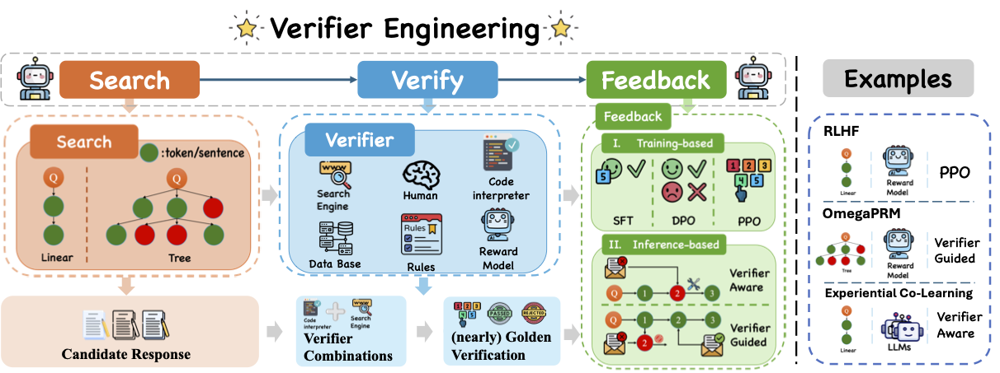

# Search, Verify and Feedback: Towards Next Generation Post-training Paradigm of Foundation Models via Verifier Engineering





This is a collection of papers and other resources for verifier engineering, which corresponds to the paper [Search, Verify and Feedback: Towards Next Generation Post-training Paradigm of Foundation Models via Verifier Engineering](paper/ve.pdf). We will update the paper content and this repo regularly, and we very much welcome suggestions of any kind.


## Overview of Common Verifiers

| **Verifier Type**    | **Verification Form**           | **Verify Granularity**               | **Verifier Source**   | **Extra Training** |
|-----------------------|---------------------------------|---------------------------------------|-----------------------|--------------------|
| Golden Annotation     | Binary/Text                   | Thought Step/Full Trajectory         | Program Based         | No                 |
| Rule-based            | Binary/Text                   | Thought Step/Full Trajectory         | Program Based         | No                 |
| Code Interpreter      | Binary/Score/Text             | Token/Thought Step/Full Trajectory   | Program Based         | No                 |
| ORM                   | Binary/Score/Rank/Text        | Full Trajectory                      | Model Based           | Yes                |
| Language Model        | Binary/Score/Rank/Text        | Thought Step/Full Trajectory         | Model Based           | Yes                |
| Tool                  | Binary/Score/Rank/Text        | Token/Thought Step/Full Trajectory   | Program Based         | No                 |
| Search Engine         | Text                          | Thought Step/Full Trajectory         | Program Based         | No                 |
| PRM                   | Score                         | Token/Thought Step                   | Model Based           | Yes                |
| Knowledge Graph       | Text                          | Thought Step/Full Trajectory         | Program Based         | No                 |


## A Verifier Engineering Perspective on Post-training Methods


🌟 Feel free to submit pull requests to include your work from the perspective of verifier engineering!


|  | Search         | Verify                          | Feedback                   | Task                   |
|---------------------------|-----------------------------------|----------------------------------|-----------------------------------|------------------------|
| [STar](https://arxiv.org/abs/2203.14465) <br>  [RFT](https://arxiv.org/abs/2308.01825) <br>  [WizardMath](https://arxiv.org/abs/2308.09583)    | Linear                            | Golden Annotation               | Imitation Learning     | Math       |
| [CAG](https://arxiv.org/abs/2404.06809)                      | Linear                            | Golden Annotation               | Imitation Learning     | RAG        |
| [Self-Instruct](https://arxiv.org/abs/2212.10560)            | Linear                     | Rule-based                      | Imitation Learning     | General    |
| [Code Alpaca](https://github.com/sahil280114/codealpaca) <br>  [WizardCoder](https://arxiv.org/abs/2306.08568) | Linear                            | Rule-based                      | Imitation Learning     | Code       |
| [ILF-Code](https://arxiv.org/abs/2303.16749)                 | Linear                      | Code interpreter <br>  Human        | Imitation Learning     | Code       |
| [RAFT](https://arxiv.org/abs/2403.10131) <br>  [RRHF](https://arxiv.org/abs/2304.05302)                | Linear                            | ORM                             | Imitation Learning     | General    |
| [SSO](https://arxiv.org/abs/2410.17131)                      | Linear                            | Rule-based                      | Preference Learning    | Alignment  |
| [CodeUltraFeedback](https://arxiv.org/abs/2403.09032)        | Linear                            | Language Model                  | Preference Learning    | Code       |
| [Self-Rewarding](https://arxiv.org/abs/2401.10020)           | Linear                            | Language Model                  | Preference Learning    | Alignment  |
| [StructRAG](https://arxiv.org/abs/2410.08815)                | Linear                            | Language Model                  | Preference Learning    | RAG        |
| [MCTS-DPO](https://arxiv.org/html/2405.00451v2)                 | Tree                              | Language Model                  | Preference Learning    | Math       |
| [Chain of Preference Optimization](https://arxiv.org/abs/2406.09136) | Tree                     | Language Model                  | Preference Learning    | Reasoning  |
| [LLAMA-BERRY](https://arxiv.org/abs/2410.02884)              | Tree                              | ORM                             | Preference Learning    | Reasoning  |
| [Math-Shepherd](https://arxiv.org/abs/2312.08935)            | Linear                            | Golden Annotation <br>  Rule-based  | Reinforcement Learning | Math       |
| [Rltf](https://arxiv.org/abs/2307.04349) <br>  [PPOCoder](https://arxiv.org/abs/2301.13816)           | Linear                            | Code Interpreter                | Reinforcement Learning | Code       |
| [RLAIF](https://openreview.net/forum?id=AAxIs3D2ZZ)                    | Linear                            | Language Model                  | Reinforcement Learning | General    |
| [SIRLC](https://arxiv.org/abs/2305.14483)                    | Linear                            | Language Model                  | Reinforcement Learning | Reasoning  |
| [RLFH](https://arxiv.org/abs/2406.12221)                     | Linear                            | Language Model                  | Reinforcement Learning | Knowledge  |
| [RLHF](https://arxiv.org/abs/2203.02155)                     | Linear                            | ORM                             | Reinforcement Learning | Alignment  |
| [Quark](https://arxiv.org/abs/2205.13636)                   | Linear                            | Tool                            | Reinforcement Learning | Alignment  |
| [ReST-MCTS](https://arxiv.org/abs/2406.03816)               | Tree                              | Language Model                  | Reinforcement Learning | Math       |
| [CRITIC](https://arxiv.org/abs/2305.11738)                   | Linear                            | Code Interpreter <br>  Tool <br>  Search Engine | Verifier-Aware  | Math <br>  Code <br>  Knowledge <br>  General |
| [Self-Debug](https://arxiv.org/abs/2304.05128)           | Linear                            | Code Interpreter                | Verifier-Aware         | Code       |
| [Self-Refine](https://arxiv.org/abs/2303.17651)              | Linear                            | Language Model                  | Verifier-Aware         | Alignment  |
| [ReAct](https://arxiv.org/abs/2210.03629)                    | Linear                            | Search Engine                   | Verifier-Aware         | Knowledge  |
| [Constrative Decoding](https://arxiv.org/abs/2210.15097)     | Linear                            | Language Model                  | Verifier-Guided        | General    |
| [Chain-of-Verification](https://arxiv.org/abs/2309.11495)    | Linear                            | Language Model                  | Verifier-Guided        | Knowledge  |
| [Inverse Value Learning](https://arxiv.org/abs/2410.21027)   | Linear                            | Language Model                  | Verifier-Guided        | General    |
| [PRM](https://arxiv.org/abs/2305.20050)                  | Linear                            | PRM                             | Verifier-Guided        | Math       |
| [KGR](https://arxiv.org/abs/2311.13314)                      | Linear                            | Knowledge Graph                 | Verifier-Guided        | Knowledge  |
| [UoT](https://arxiv.org/abs/2402.03271)                      | Tree                              | Language Model                  | Verifier-Guided        | General    |
| [ToT](https://arxiv.org/abs/2305.10601)                      | Tree                              | Language Model                  | Verifier-Guided        | Reasoning  |


# Citation

If you find our repo useful in your research, please consider citing:

```
@article{VerifierEngineering,
    title={Search, Verify and Feedback: Towards Next Generation Post-training Paradigm of Foundation Models via Verifier Engineering},
    author={Xinyan Guan, Yanjiang Liu, Xinyu Lu, Boxi Cao, Ben He, Xianpei Han, Le Sun, Jie Lou, Bowen Yu, Yaojie Lu, Hongyu Lin},
    journal={},
    url={}
    year={2024}
}

```
